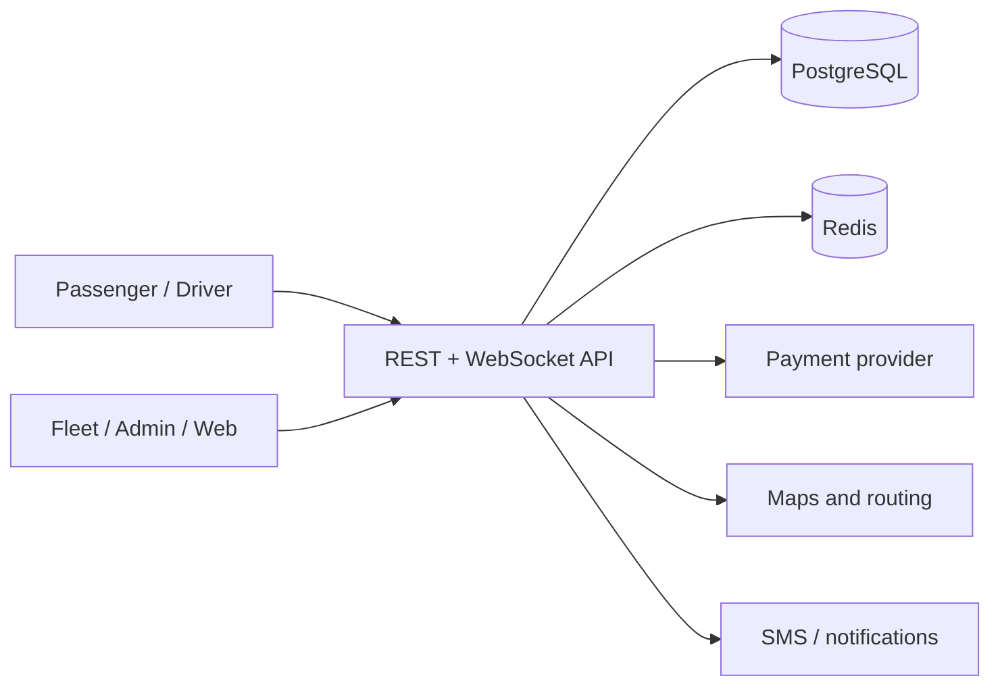

# Architecture

## System context

LibSwiftRide is a modular monorepo. Five React clients consume a versioned Express API. PostgreSQL is the system of record. Redis holds short-lived driver presence and GPS samples. External payment, mapping, SMS and identity providers attach through adapters.

## Domain boundaries

- **Identity:** users, credentials, refresh sessions, roles and account state.
- **Mobility:** quotes, dispatch, ride state machine, GPS presence and trip events.
- **Fleet:** drivers, vehicles, compliance and fleet ownership.
- **Finance:** payment attempts, provider references, fare allocation and settlements.
- **Operations:** admin metrics, support access, safety cases and audit logs.

The initial code is a modular monolith. This minimizes distributed failure modes while domain boundaries settle. High-volume location ingestion, dispatch and notification workers can be extracted behind event contracts later.

## Ride lifecycle

`REQUESTED → SEARCHING → DRIVER_ASSIGNED → DRIVER_ARRIVING → DRIVER_ARRIVED → IN_PROGRESS → COMPLETED`

Cancellation may occur before completion. Every transition must validate the actor, current state, and required fields inside a transaction, then append a `RideEvent`.

## Financial invariant

For a completed fare `F` in minor units:

`company = round(F × 0.12)` and `driver = F − company`

This guarantees allocations always sum to the collected fare. Promotions, tips, tolls, refunds, taxes, fleet fees and provider fees need separate ledger entries rather than altering this invariant.

## Scaling path

Run multiple stateless API replicas behind a TLS load balancer. Use Redis pub/sub or streams to fan out WebSocket location events. Add PostGIS for spatial queries, a job queue for dispatch and notifications, read replicas for analytics, and object storage for encrypted compliance documents.
